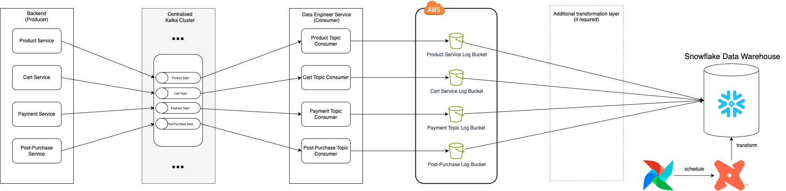
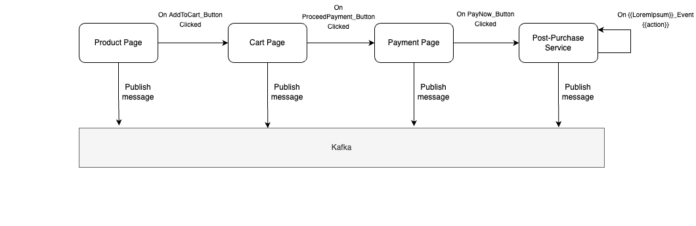

## 📋 Table of Contents

1. [Understanding Business Goals and Expectations](#-understanding-business-goals-and-expectations)
2. [Defining Technical Architecture](#%EF%B8%8F-defining-technical-architecture)
3. [Architecture Diagram](#%EF%B8%8F-architecture-diagram) 
4. [Explanation of Architecture](#-explanation-of-architecture)
5. [Advantage & Disadvantage](#%EF%B8%8F-advantage-and-disadvantage)

## 🎯 Understanding Business Goals and Expectations

Before diving into technical details, it is important to start by defining the Business Objective and Key Results (OKRs). Establishing these will provide guidance about technical requirements during the design process. Below is an example of Business OKRs:

#### Objective 1: Enhance Understanding of Consumer Behaviour
- ***Key Result 1:*** Conduct user journey mapping for 80% of app users by the end of Q3.
- ***Key Result 2:*** Identify and document the top 5 pain points in the booking process within 60 days.

#### Objective 2: Improve Conversion Rate through Data-Driven Insights
- ***Key Result 1:*** Analyse booking funnel data to identify a 10% drop-off at each stage within the next quarter.
- ***Key Result 2:*** A/B test 3 different user flow optimizations and select the most effective one based on a 5% improvement in booking completion rates.

#### Objective 3: Optimize User Experience Across Platforms
- ***Key Result 1:*** Reduce the average booking time by 20% on both mobile and web platforms by the end of Q4.
- ***Key Result 2:*** Increase the number of repeat bookings by 25% through targeted user journey improvements within the next 2 quarters.

By this, we can reasonably conclude that the Product Manager and Business Analyst will have bi-weekly meetings to review progress on the consumer journey analysis and assess the effectiveness of implemented strategies.

## 🛠️ Defining Technical Architecture

To store event data in the data warehouse and analyze events such as successful payments, barcode scans, or items added to the cart, we need to prepare the facts and questions to guide the technical architecture decisions.

### Facts:
1. Event logs are expensive.
2. Tracking new events or modifying existing events is costly.

### Questions:
1. Has the backend team ever produced events before?
2. What is the event streaming platform currently being used by the backend team? (e.g., Kafka, Pub/Sub, Kinesis)
3. What is the cost comparison between utilizing existing events and having the backend team create new events for the data engineers?
4. What type of database is used for the data warehouse? (OLAP, OLTP, which vendors?)
5. Should we store raw events in a data lake, NoSQL DB, or Relational DB?
6. How granular do we want to track the events?
7. What is the budget allocated for the project?
8. What is the data retention policy, and does it involve PII data?
9. How proficient is the team in using the tools and technologies in use?

For this scenario, let’s assume Kafka is the event streaming platform, Snowflake is used for the data warehouse, Amazon S3 is used for the data lake, the backend team has the capacity to create new events for data engineers, PII data is involved, and it is necessary to store the data for up to 2 years. In parallel, based on OKRs and business expectations, we can estimate that real-time data is not required, and batch-processing is adequate to track relevant metrics for the business.

## 🏗️ Architecture Diagram
End-to-end Diagram:

  

  <em>Figure 1: End-to-end diagram</em>

User Action Diagram:

  

  <em>Figure 2: User Action diagram</em>

Sample of event message:
| **Messages**       | **JSON File**                               |
|----------------|---------------------------------------------|
| Product page message         | [JSON](messages/product_page_message.json)    |
| Cart page message            | [JSON](messages/cart_page_message.json)    |
| Payment page message         | [JSON](messages/payment_page_message.json)    |
| Confirmation page message    | [JSON](messages/confirmation_page_message.json)    |

## 📝 Explanation of Architecture

Main goal of this architecture is to create a data product driven by service its originated from. In this architecture, I’m choosing scenario in which each service is managed by separate team. Backend team will be responsible for owning service and publishing message to Kafka Broker. Ownership of Kafka Broker can be hand overed to SRE team or Data Engineering team. Data engineer will own all consumer service for every Kafka topic. The consumer services will store the event logs to AWS S3 grouped by origin of service. From here, we can either do ELT by utilising Snowflake’s external table feature + DBT or ETL by creating transformation process between S3 and Snowflake.

My opinion on why this architecture is preferred, I wanted to minimise unnecessary data transformation further from data warehouse. Unnecessary transformation might add maintenance cost to the team in the long run. I tried to keep data flowing from source unprocessed up to data lake. By creating topic for separate service also increase ease of maintenance and helps system scale in case of peaks in user traffic. S3 as data lake are preferred to store raw log events due to relatively lower cost (vs other solutions) and strong integration with Snowflake. Separating S3 buckets based on the origin of the service also helps in managing data governance, especially concerning PII. Specific policies can be implemented for each bucket.

This design will also address how to retrieve new data about a past event, particularly if the field was already tracked and published by the producer before the business requirement emerged, and no transformation or filtering occurred between Kafka, the consumer, and the S3 bucket. The necessary information can be brought from S3 to the data warehouse using either Snowflake external storage or Spark.

## ⚖️ Advantage and Disadvantage
### Advantage

1. **Scalability:**
   - Each service operates independently, allowing for horizontal scaling. As traffic increases, individual services can be scaled without impacting others.
   - Decoupled services communicating via Kafka topics reduce dependencies between services, making it easier to modify or replace individual components without affecting the entire system.
   - Each service having its own Kafka topic and consumer pipeline simplifies troubleshooting and allows teams to focus on domain-specific improvements without needing to understand the entire system.

2. **Improved Fault Tolerance:**
   - With each service writing to its own Kafka topic, failures in one service do not directly impact others. Kafka's built-in durability and replication features also enhance system resilience.

3. **Flexibility in Data Storage:**
   - Domain-specific S3 buckets allow services to store data in a manner tailored to their needs, facilitating optimized storage strategies and easier data retrieval.

4. **Enhanced Data Governance and Compliance:**
   - By isolating data flows within specific Kafka topics and S3 buckets, it becomes easier to enforce data governance policies. Domain-specific storage can ensure that compliance requirements are met more efficiently, as data can be managed and audited on a per-domain basis.

### Disadvantage

1. **Increased Complexity:**
   - Managing multiple Kafka topics, consumers, and domain-specific S3 buckets increases system complexity. This requires more sophisticated monitoring, logging, and debugging tools.

2. **Data Stored in Silos:**
   - With data stored in domain-specific S3 buckets, there is a risk of creating data silos. Aggregating and analyzing data across domains may become more challenging, requiring additional ETL processes or data pipelines.

3. **Higher Costs:**
   - Running a robust Kafka infrastructure, along with managing multiple S3 buckets for different domains, can be costly in terms of both operational expenses and cloud storage fees.
  
### 🗨️ Contacts

If you have any questions, feedback, or collaboration ideas, feel free to reach out!

- **Email**: [setra.wicana.uk@gmail.com](mailto:setra.wicana.uk@gmail.com).
- **LinkedIn**: [Setra Genyang Wicana](https://www.linkedin.com/in/setragenyangw/).
